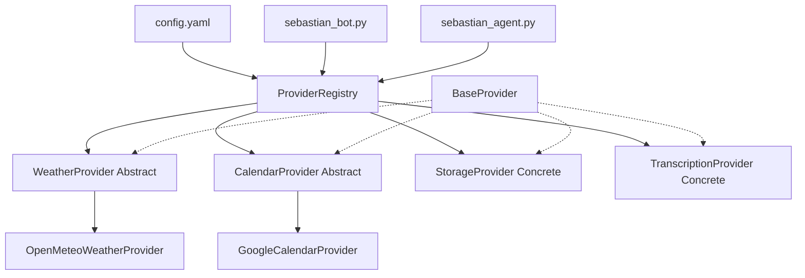

# Sebastian Bot - Architecture

## The Problem

Sebastian is a Telegram bot that needs to integrate with multiple external services (weather APIs, Google Calendar, Dropbox, OpenAI Whisper) while maintaining clean code organization and reliable error handling. As the bot grew, scattered provider directories (weather/, mycalendar/, mydropbox/, mp3totext/) made it difficult to:

- Add new service integrations consistently
- Handle network failures and retries uniformly
- Test and maintain provider code in isolation
- Understand the bot's integration points at a glance

## The Solution

The bot uses a centralized **Provider Pattern** with a registry system that manages all external service integrations. Each provider is a self-contained module with retry logic, health checks, and standardized initialization.



## Provider Architecture

### Overview

All providers inherit from `BaseProvider` which provides:
- **Automatic retry logic**: 3 retries with exponential backoff (2s → 4s → 8s) for transient errors
- **Structured logging**: All operations logged via loguru
- **Configuration validation**: Ensures required credentials/settings are present
- **Health checks**: Verifies provider connectivity on startup

### Abstract vs Concrete Providers

**Abstract Providers** (swappable implementations):
- **WeatherProvider**: Can be swapped between OpenMeteo, WeatherAPI, etc.
  - Current implementation: `OpenMeteoWeatherProvider`
  - Provides: Weather summary and full report tools

- **CalendarProvider**: Can be swapped between Google Calendar, Outlook, etc.
  - Current implementation: `GoogleCalendarProvider`
  - Provides: Event retrieval for upcoming days

**Concrete Providers** (specific implementations):
- **StorageProvider**: Dropbox-specific implementation
  - No abstraction needed - tightly coupled to Dropbox API
  - Provides: File upload functionality

- **TranscriptionProvider**: OpenAI Whisper-specific implementation
  - No abstraction needed - uses OpenAI's Whisper API
  - Provides: Audio transcription

### Provider Flow

1. **Initialization** (sebastian_bot.py startup):
   ```
   config.yaml → ProviderRegistry → Initialize each provider → Health checks
   ```

2. **Runtime** (handling user requests):
   ```
   User message → sebastian_bot.py → Provider method → Retry wrapper → External API
                                   ↓
                           sebastian_agent.py → Provider tools → LangChain agent
   ```

3. **Error Handling**:
   ```
   API call fails → Retry logic (3x) → Success: Return result
                                    ↓
                                    Failure: Log error + return graceful fallback
   ```

## Key Decisions

### Why Provider Pattern?

**Context**: The bot integrates with 4+ external services, each with different APIs, authentication methods, and error behaviors. Early implementation had scattered code in separate directories without consistent error handling.

**Decision**: Centralized provider pattern with base class providing retry logic

**Reasons**:
- **Easy to add providers**: New integrations follow the same template (inherit from BaseProvider)
- **Consistent error handling**: All providers get automatic retries and logging
- **Self-contained modules**: Each provider has its own config class and implementation
- **Testable**: Providers can be unit tested independently
- **Health checks**: Bot startup fails fast if critical providers are misconfigured

**Trade-off accepted**: Slightly more complex than direct API calls in bot handlers, but dramatically easier to extend and maintain. The upfront abstraction pays off after the 2nd or 3rd provider.

### Why Abstract vs Concrete?

**Context**: Some providers (weather, calendar) have multiple potential implementations, while others (Dropbox, Whisper) are tightly coupled to specific services.

**Options considered**:
1. Make all providers abstract - Overengineering, adds unnecessary abstraction layers
2. Make all providers concrete - No flexibility to swap implementations
3. Hybrid approach - Abstract only when swappability is likely

**Decision**: Hybrid approach with abstract base classes only for swappable providers

**Reasons**:
- Weather APIs are interchangeable (OpenMeteo, WeatherAPI, Tomorrow.io)
- Calendar APIs are interchangeable (Google, Outlook, CalDAV)
- Dropbox API is unique - no point abstracting
- Whisper API is unique - no point abstracting
- Reduces complexity while maintaining flexibility where needed

**Trade-off accepted**: If we need to swap Dropbox or Whisper later, we'll need to refactor. This is acceptable because changing storage/transcription providers is rare compared to weather/calendar.

### Why Retry Logic in BaseProvider?

**Context**: External APIs fail frequently due to network issues, rate limits, and temporary outages. Early implementation had no retries, causing user-visible failures.

**Decision**: Centralized retry logic in BaseProvider using tenacity library

**Reasons**:
- **DRY principle**: Don't repeat retry logic in each provider
- **Consistent behavior**: All providers retry the same way
- **Smart retry**: Only retry transient errors (network, timeout), fail fast on auth/config errors
- **Exponential backoff**: Prevents overwhelming failing services
- **Observable**: All retries logged with full context

**Trade-off accepted**: Adds 4-12 seconds delay on persistent failures (2s + 4s + 8s). This is acceptable because most transient errors resolve within 1-2 retries, and persistent failures are rare.

## Data Flow

### Message Handling Flow

1. **User sends message** to Telegram bot
   - Input: Raw Telegram message object

2. **sebastian_bot.py receives message**
   - Checks authorization
   - Routes based on command (`/imagen`, `/calendario`, etc.) or defaults to agent

3. **Provider interaction** (two paths):

   **Path A - Direct provider calls** (e.g., `/calendario` command):
   ```
   Command handler → ProviderRegistry.get('calendar') → GoogleCalendarProvider.get_events()
                                                       → Google Calendar API (with retries)
                                                       → Formatted event list
   ```

   **Path B - Agent-based** (no command, plain text):
   ```
   sebastian_agent.py → LangChain agent → Tool selection
                                        → Provider tool (e.g., WeatherSummary)
                                        → Provider method → External API
                                        → Agent formats response
   ```

4. **Response sent** back to user via Telegram

### Provider Initialization Flow

1. **Bot startup**: `python sebastian_bot.py`
2. **Load config**: `config.yaml` → dict
3. **Create registry**: `ProviderRegistry(config)`
4. **Initialize providers**:
   - Check if provider configured in config.yaml
   - Create config object (validates credentials)
   - Instantiate provider (connects to API)
   - Run health check (verify connectivity)
   - Log success/failure
5. **Aggregate tools**: `get_all_tools()` → LangChain agent
6. **Bot ready**: Start polling for messages

## Main Components

### ProviderRegistry

**Responsibility**: Centralized manager for all providers

**Inputs**: Full config.yaml dict

**Outputs**:
- Provider instances (via `get(name)`)
- Aggregated LangChain tools (via `get_all_tools()`)

**Key methods**:
- `_initialize_providers()`: Create provider instances from config
- `_run_health_checks()`: Verify all providers are working
- `get(name)`: Retrieve specific provider
- `get_all_tools()`: Aggregate tools from all providers for agent

### BaseProvider

**Responsibility**: Base class providing retry logic and logging

**Inputs**: ProviderConfig subclass

**Outputs**: Configured provider with retry capabilities

**Key features**:
- `_call_with_retry()`: Wraps API calls with tenacity retry logic
- `health_check()`: Abstract method for provider verification
- Automatic config validation on init
- Structured logging for all operations

### ProviderConfig Classes

**Responsibility**: Configuration and validation for each provider

**Classes**:
- `WeatherConfig`: Cities dict, cache hours, refranes file path
- `CalendarConfig`: Service account file, calendar ID, OAuth scopes
- `StorageConfig`: Dropbox refresh token, app key, app secret
- `TranscriptionConfig`: OpenAI API key

**Key features**:
- `validate()`: Check required fields and file paths exist
- `__repr__()`: Safe string representation (hides secrets)

### Provider Implementations

**WeatherProvider** (abstract → OpenMeteoWeatherProvider):
- **Methods**: `get_current_weather()`, `get_weather_report()`
- **Tools**: WeatherSummary, WeatherReport (LangChain tools)
- **External API**: OpenMeteo forecast API
- **Caching**: 1-hour HTTP cache via requests_cache

**CalendarProvider** (abstract → GoogleCalendarProvider):
- **Methods**: `get_events(days_ahead)`
- **Tools**: None (called directly from bot commands)
- **External API**: Google Calendar API v3
- **Auth**: Service account credentials

**StorageProvider** (concrete, Dropbox):
- **Methods**: `upload_file(file_blob, file_name, folder)`
- **Tools**: None (called directly from bot handlers)
- **External API**: Dropbox API v2
- **Auth**: OAuth2 refresh token

**TranscriptionProvider** (concrete, Whisper):
- **Methods**: `transcribe_audio(file_path, language)`
- **Tools**: None (called directly from bot handlers)
- **External API**: OpenAI Whisper API
- **Auth**: OpenAI API key

## Integration with LangChain Agent

Providers that expose tools (`get_tools()`) integrate with the LangChain agent:

1. **Provider creates tools**: Each tool wraps a provider method with descriptive metadata
2. **Registry aggregates tools**: `ProviderRegistry.get_all_tools()` collects all tools
3. **Agent receives tools**: sebastian_agent.py combines provider tools + core tools
4. **Agent selects tools**: OpenAI function calling chooses appropriate tool based on description
5. **Tool executes**: Calls provider method → API call (with retries) → Returns result
6. **Agent formats response**: LangChain agent presents result to user

Example: User asks "What's the weather?" → Agent selects WeatherSummary tool → Calls OpenMeteoWeatherProvider.get_current_weather() → Fetches from OpenMeteo API → Returns formatted weather report

## Error Handling Strategy

### Transient Errors (Retried)
- Network timeouts
- Connection resets
- HTTP 5xx errors
- Temporary API outages

**Behavior**: Retry 3 times with exponential backoff, log each attempt

### Non-Transient Errors (Fail Fast)
- Authentication failures (HTTP 401)
- Configuration errors (missing API keys)
- Validation errors (invalid input)
- HTTP 4xx errors (except 429 rate limit)

**Behavior**: Fail immediately, log error with full context

### Fallback Responses
- Weather provider: Returns random refran (Spanish saying) if API fails
- Calendar provider: Returns "No events" message
- Storage/Transcription: Propagate exception to caller

## Configuration Structure

```yaml
# config.yaml structure for providers

weather:
  cities:
    madrid: [40.4165, -3.7026]
    gijón: [43.5357, -5.6615]
  cache_hours: 1
  refranes_file: data/refranes.txt

google_calendar:
  service_account_file: mycalendar/credentials.json
  calendar_id: primary
  scopes:
    - https://www.googleapis.com/auth/calendar

dropbox:
  refresh_token: xxx
  app_key: xxx
  app_secret: xxx
  app_name: SebastianAssistant

openai_apikey: xxx  # Used by TranscriptionProvider
```

## Extension Points

### Adding a New Provider

1. **Create config class** in `providers/config.py`:
   ```python
   class NewProviderConfig(ProviderConfig):
       def validate(self) -> bool:
           # Validate required fields
           pass
   ```

2. **Create provider class** in `providers/new_provider.py`:
   ```python
   class NewProvider(BaseProvider):
       def health_check(self) -> bool:
           # Verify connectivity
           pass
   ```

3. **Register in ProviderRegistry** (`providers/__init__.py`):
   ```python
   if 'new_provider' in self.config:
       config = NewProviderConfig(self.config['new_provider'])
       self.providers['new_provider'] = NewProvider(config)
   ```

4. **Add configuration** to `config.yaml`

See [docs/HOW-TO-ADD-PROVIDER.md](docs/HOW-TO-ADD-PROVIDER.md) for detailed guide.

## Future Enhancements

### Planned Improvements
- **City extraction**: Parse city names from user questions (currently hardcoded to Madrid)
- **Provider metrics**: Track API call counts, latency, success rates
- **Circuit breaker**: Disable failing providers temporarily instead of retrying forever
- **Tool descriptions**: Generate tool descriptions dynamically from provider metadata

### Potential New Providers
- **Notification provider**: Send emails, SMS, push notifications
- **Translation provider**: Multi-language support (DeepL, Google Translate)
- **Image provider**: Image analysis, OCR (beyond current DALL-E generation)
- **Database provider**: Store conversation history, user preferences
