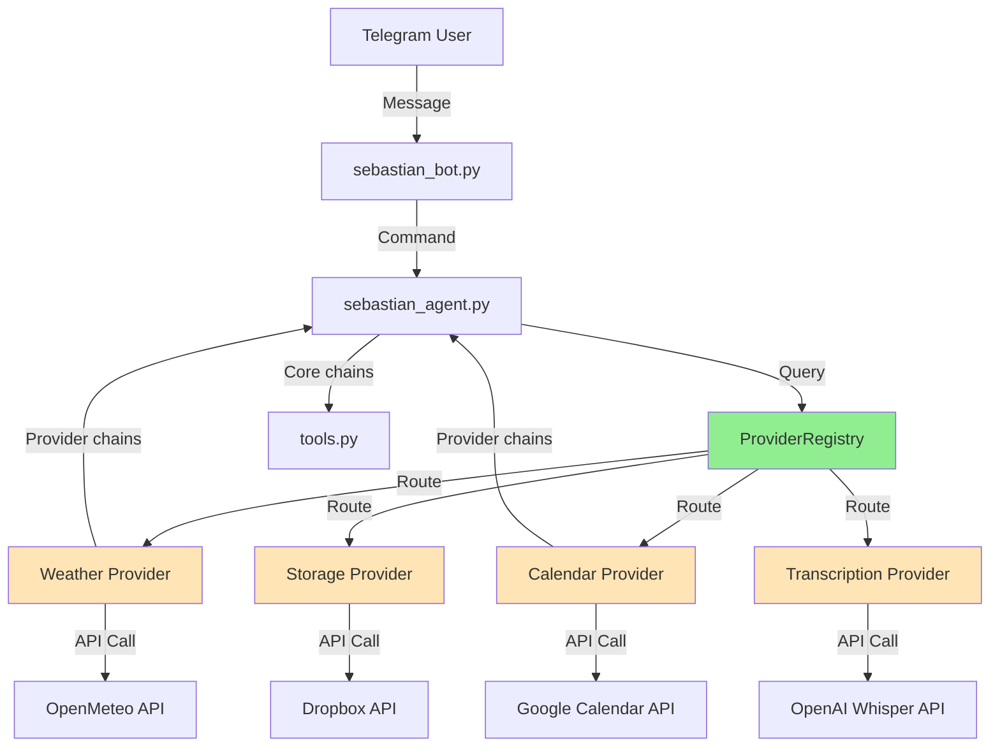

# Sebastian Bot - Provider Refactoring Design

> **Date**: 2026-02-13
> **Status**: Approved
> **Approach**: Modular Provider Architecture (Approach 2)

---

## The Problem

The Sebastian Telegram bot has grown organically with functionality scattered across multiple directories (`weather/`, `mycalendar/`, `mydropbox/`, `mp3totext/`). Each integration is implemented differently with inconsistent error handling, configuration patterns, and no clear way to add new providers. Experimental code is mixed with production code, making maintenance difficult.

**Pain points**:
- Adding new providers (Blogger, Instagram, n8n) requires understanding different patterns
- No retry logic for transient API failures
- Configuration scattered between `config.yaml` and `.env` without validation
- Test/experimental code (`tester.py`, notebooks, `legacytests/`) mixed with production
- LangChain chains mixed between `tools.py` and provider-specific logic
- Standard logging (Python logging) provides limited structure

---

## The Solution

Create a modular provider architecture with:
1. **Base provider class** with retry logic and structured logging (loguru)
2. **Abstract providers** for swappable services (weather, calendar, social media)
3. **Concrete providers** for stable integrations (Dropbox, Whisper)
4. **Provider registry** for initialization and tool registration
5. **Clean separation** of production code vs experiments



---

## Key Decisions

### Decision 1: Hybrid Provider Abstraction

**Context**: Some services (weather, calendar) might be swapped in the future, while others (Whisper, Dropbox) are stable.

**Options considered**:
1. **All abstract** - Maximum flexibility but over-engineering for stable services
2. **All concrete** - Simpler but hard to swap providers later
3. **Hybrid** - Abstract where swapping makes sense, concrete otherwise

**Decision**: Hybrid approach

**Reasons**:
- Weather providers can be swapped (OpenMeteo → WeatherAPI)
- Calendar providers can be swapped (Google → Outlook)
- Social media publishers will have multiple implementations (Blogger, Instagram)
- Dropbox and Whisper unlikely to change - concrete is simpler
- Balances flexibility with pragmatism

**Trade-off accepted**: Slightly more complex base classes, but easier to extend

---

### Decision 2: Keep Current config.yaml + .env

**Context**: Adding more providers (Instagram, Blogger, n8n) means more configuration.

**Options considered**:
1. **Pydantic Settings** - Type-safe, validation built-in
2. **Environment-only** - Simple but messy with many providers
3. **Keep YAML + .env** - Current familiar pattern

**Decision**: Keep YAML + .env with provider-specific config classes for validation

**Reasons**:
- Team already familiar with YAML structure
- Provider config classes add validation without changing files
- Easy to organize: each provider gets own section in `config.yaml`
- No migration pain for existing setup

**Trade-off accepted**: Manual validation in code vs automatic with Pydantic

---

### Decision 3: Stay Synchronous

**Context**: Adding more providers could benefit from async operations.

**Options considered**:
1. **Migrate to async** - Better concurrency but requires refactoring bot framework
2. **Hybrid providers** - Async internally, sync interface
3. **Stay synchronous** - Simple, current framework works

**Decision**: Stay synchronous

**Reasons**:
- Current bot performance is acceptable
- telebot library is sync-based, migration would be large effort
- Bot traffic is low-to-moderate, concurrency not critical
- Can add async later if needed (via Approach 3 path)

**Trade-off accepted**: Sequential operations vs concurrent, acceptable for current load

---

### Decision 4: Retry for Transient Errors, Fail Fast Otherwise

**Context**: API calls can fail for different reasons (network, auth, rate limits).

**Options considered**:
1. **Retry everything** - Wastes time on permanent errors
2. **Never retry** - User sees errors from transient issues
3. **Smart retry** - Retry transient (network, timeout), fail fast on auth/config

**Decision**: Use `tenacity` library to retry only transient errors (network, timeout, rate limits)

**Reasons**:
- Transient errors (connection reset, temporary API downtime) often resolve in seconds
- Auth errors and config issues won't fix themselves - fast feedback better
- 3 retries with exponential backoff (2s → 4s → 8s) reasonable
- Reduces user-visible errors without wasting time

**Trade-off accepted**: Some commands take longer when retrying vs immediate failure

---

### Decision 5: Loguru Instead of Standard Logging

**Context**: Need better structured logging as project grows.

**Options considered**:
1. **Keep Python logging** - Already set up but limited
2. **Loguru** - Better formatting, rotation, easier to use
3. **structlog** - Most powerful but overkill

**Decision**: Migrate to loguru

**Reasons**:
- Drop-in replacement, minimal migration effort
- Automatic log rotation and compression
- Color-coded console output for easier debugging
- Separate error logs for critical issues
- Better exception formatting

**Trade-off accepted**: New dependency vs marginal benefit (acceptable)

---

## Data Flow

### Current Flow (Before Refactoring)

1. **User sends message** → `sebastian_bot.py` receives via telebot
2. **Command routing**:
   - Specific command (`/imagen`, `/calendario`) → Direct handler
   - No command → Routes to LangChain agent
3. **Agent processes** → Selects tool from `tools.py`
4. **Tool executes** → Calls provider code directly (`weather/openmeteo.py`, etc.)
5. **Response** → Bot sends to user

### New Flow (After Refactoring)

1. **Bot startup**:
   - Load `config.yaml`
   - `ProviderRegistry` initializes all providers
   - Each provider validates config and registers LangChain tools
   - Agent receives combined tool list (core + all providers)

2. **User message**:
   - Bot receives message
   - Command handler or agent selects appropriate tool
   - Tool calls provider method (e.g., `weather_provider.get_current_weather()`)
   - Provider executes with retry logic via `BaseProvider._call_with_retry()`
   - On error: Retry transient, fail fast on others, log everything
   - Response returned to bot → user

3. **Adding new provider** (future):
   - Create provider class inheriting `BaseProvider` or abstract provider
   - Implement required methods + `get_tools()`
   - Add config section to `config.yaml`
   - Register in `ProviderRegistry.__init__()`
   - Provider automatically integrated

---

## Main Components

### BaseProvider

**Responsibility**: Common functionality for all providers (retry, logging, health checks)

**Inputs**: `ProviderConfig` subclass

**Outputs**: None (base class)

**Key methods**:
- `_call_with_retry()`: Wraps API calls with tenacity retry logic
- `health_check()`: Abstract method for provider health verification
- `__init__()`: Validates config, sets up logging

**Dependencies**: loguru, tenacity

---

### ProviderRegistry

**Responsibility**: Initialize all providers, collect tools for agent

**Inputs**: Global `config` dict from `config.yaml`

**Outputs**:
- `get_all_tools()`: Combined list of LangChain tools
- `get(name)`: Access to specific provider

**Key methods**:
- `_initialize_providers()`: Creates provider instances from config
- `get_all_tools()`: Aggregates tools from all providers

**Dependencies**: All provider classes

---

### WeatherProvider (Abstract)

**Responsibility**: Interface for weather services

**Implementations**: `OpenMeteoWeatherProvider` (current)

**Inputs**: City name

**Outputs**: Weather data dict

**Tools provided**:
- `WeatherSummary`: Current weather
- `WeatherReport`: Full newspaper-style report with Spanish sayings

---

### CalendarProvider (Abstract)

**Responsibility**: Interface for calendar services

**Implementations**: `GoogleCalendarProvider` (current)

**Inputs**: Date range (default: tomorrow)

**Outputs**: List of events

**Tools provided**:
- `GetCalendarEvents`: Fetch events for date range

---

### StorageProvider (Concrete)

**Responsibility**: File upload to Dropbox

**Inputs**: File blob, filename, folder

**Outputs**: Upload metadata

**Dependencies**: Dropbox API, `config.yaml` (dropbox section)

---

### TranscriptionProvider (Concrete)

**Responsibility**: Audio transcription via Whisper

**Inputs**: Audio file

**Outputs**: Transcribed text

**Dependencies**: OpenAI API (Whisper)

---

## Directory Structure

### Before
```
sebastian/
├── sebastian_bot.py
├── sebastian_agent.py
├── tools.py
├── utils/
│   └── utils.py
├── weather/
│   ├── openmeteo.py
│   └── refranes.txt
├── mycalendar/
│   └── googlecal.py
├── mydropbox/
│   └── upload_dropbox.py
├── mp3totext/
│   └── whisper_openai.py
├── tester.py                # Mixed with production!
├── test_oauth.py            # Mixed with production!
├── *.ipynb                  # Mixed with production!
└── legacytests/             # Mixed with production!
```

### After
```
sebastian/
├── providers/                    # NEW: Centralized providers
│   ├── __init__.py              # ProviderRegistry
│   ├── base.py                  # BaseProvider + retry logic
│   ├── config.py                # Config classes per provider
│   ├── weather.py               # Abstract WeatherProvider + OpenMeteo
│   ├── calendar.py              # Abstract CalendarProvider + Google
│   ├── storage.py               # Concrete StorageProvider (Dropbox)
│   └── transcription.py         # Concrete TranscriptionProvider (Whisper)
├── sebastian_bot.py             # Minimal changes (imports)
├── sebastian_agent.py           # Updated to use ProviderRegistry
├── tools.py                     # Core chains only (wine, basic Q&A, LazyPrompt)
├── utils/
│   ├── utils.py                 # Keep existing utilities
│   └── logging_config.py        # NEW: Loguru setup
├── experiments/                  # NEW: All test code isolated
│   ├── tester.py
│   ├── test_oauth.py
│   ├── *.ipynb
│   └── legacytests/
├── config.yaml                  # Enhanced with provider sections
├── .env                         # Unchanged
├── requirements.txt             # Add: loguru, tenacity
├── docs/
│   ├── plans/
│   │   └── 2026-02-13-provider-refactoring-design.md  # This doc
│   └── HOW-TO-ADD-PROVIDER.md  # Guide for extending
├── ARCHITECTURE.md              # Updated with provider pattern
└── BRIEFING.md                  # Updated with new structure
```

---

## Configuration Structure

### config.yaml (Enhanced)

```yaml
# === EXISTING CONFIGURATION (unchanged) ===
authorized_ids: [...]
authorized_users: [...]
telegram_apikey: xxx
openai_apikey: xxx
openai_org_id: xxx
logfolder: logs

# === PROVIDER-SPECIFIC CONFIGURATION (new sections) ===

weather:
  cache_hours: 1
  cities:
    madrid: [40.4165, -3.7026]
    gijón: [43.5357, -5.6615]
    oviedo: [43.3603, -5.8448]
    magán: [39.9614, -3.9316]
  refranes_file: weather/refranes.txt

google_calendar:
  service_account_file: mycalendar/Zell0ss_api-access.json
  calendar_id: zelloss@gmail.com

dropbox:
  access_token: xxx
  app_key: xxx
  app_secret: xxx
  refresh_token: xxx
  app_name: SebastianAssistant

# Future providers (examples):
# blogger:
#   blog_id: your-blog-id
#   credentials_file: blogger_credentials.json
#
# instagram:
#   username: xxx
#   access_token: xxx
#
# n8n:
#   base_url: http://localhost:5678
#   api_key: xxx
```

---

## Migration Strategy

### Phase 1: Foundation (0 breakage risk)
- Create `providers/` directory
- Create `providers/base.py`, `providers/config.py`
- Create `utils/logging_config.py`
- Move experimental code to `experiments/`
- Update `requirements.txt` (add loguru, tenacity)
- **Test**: Bot still runs unchanged

### Phase 2: Pilot Migration (Weather)
- Create `providers/weather.py` with OpenMeteo implementation
- Move weather chains from `tools.py` to weather provider
- Update `sebastian_agent.py` to initialize weather provider
- **Test**: Weather commands work identically
- Keep old `weather/` until verified

### Phase 3: Migrate Remaining Providers
- Calendar → `providers/calendar.py`
- Storage → `providers/storage.py`
- Transcription → `providers/transcription.py`
- **Test**: Each provider before moving to next

### Phase 4: Registry & Cleanup
- Implement `ProviderRegistry`
- Update `sebastian_agent.py` to use registry
- Remove old directories (`weather/`, `mycalendar/`, `mydropbox/`, `mp3totext/`)
- **Test**: All bot commands still work

### Phase 5: Documentation
- Update `ARCHITECTURE.md` with provider pattern
- Update `BRIEFING.md` with new structure
- Create `docs/HOW-TO-ADD-PROVIDER.md`
- Update `CLAUDE.md` with provider information

---

## Testing During Migration

Each phase includes manual testing:

**Weather Provider Checklist**:
- [ ] Bot starts without errors
- [ ] Weather-related messages trigger correct tool
- [ ] Unknown city returns graceful error
- [ ] API failure retries 3 times
- [ ] Spanish weather saying included
- [ ] Logs show provider initialization
- [ ] No duplicate tools registered

**Registry Checklist**:
- [ ] All providers initialize successfully
- [ ] Each provider logs initialization
- [ ] Health checks pass for all providers
- [ ] Combined tool list correct
- [ ] Agent can call all tools
- [ ] Old code removed without breaking

---

## Future Enhancement Path (Approach 3)

When the project needs to scale or becomes a team effort, evolve toward:

### Plugin System
- Auto-discover providers in `providers/` directory
- No manual registration in `ProviderRegistry`
- Providers as pip-installable packages

### Async Support
- `AsyncBaseProvider` for high-concurrency scenarios
- Migrate to `aiogram` or `python-telegram-bot` async
- Non-blocking API calls

### Testing Infrastructure
- Unit tests with `pytest`
- Mock API calls for deterministic tests
- Integration tests with test bot
- Coverage reporting

### Database Layer
- Store conversation history (SQLite/MariaDB)
- Cache API responses
- User preferences persistence

### Provider Health Dashboard
- `/status` command shows all provider health
- Web dashboard for monitoring
- Alert on provider failures

### CI/CD Pipeline
- GitHub Actions for tests
- Auto-deploy on main branch
- Docker containerization

**When to consider Approach 3**:
- Team grows beyond solo developer
- Commercial/production deployment
- High traffic/concurrent users (>100 concurrent)
- Need for uptime guarantees

---

## Success Criteria

Refactoring is successful when:

✅ All existing bot commands work identically
✅ Adding a new provider (e.g., Blogger) takes <2 hours
✅ Provider failures retry transient errors automatically
✅ Logs clearly show provider initialization and errors
✅ Experimental code completely separated from production
✅ Documentation updated and clear
✅ Future developer (or "future me") can understand architecture in <10 minutes

---

## Risk Mitigation

**Risk**: Breaking existing functionality during migration
**Mitigation**: Incremental phases, keep old code until verified, comprehensive testing checklist

**Risk**: Provider initialization failures on bot startup
**Mitigation**: Graceful degradation - bot starts even if some providers fail, logs clearly indicate issue

**Risk**: Over-engineering for current needs
**Mitigation**: Approach 2 balances extensibility with simplicity, Approach 3 documented but not implemented

**Risk**: Configuration errors harder to debug
**Mitigation**: Config validation in provider `__init__()`, clear error messages, loguru detailed logs

---

*Design approved: 2026-02-13*
*Next step: Implementation plan via writing-plans skill*
